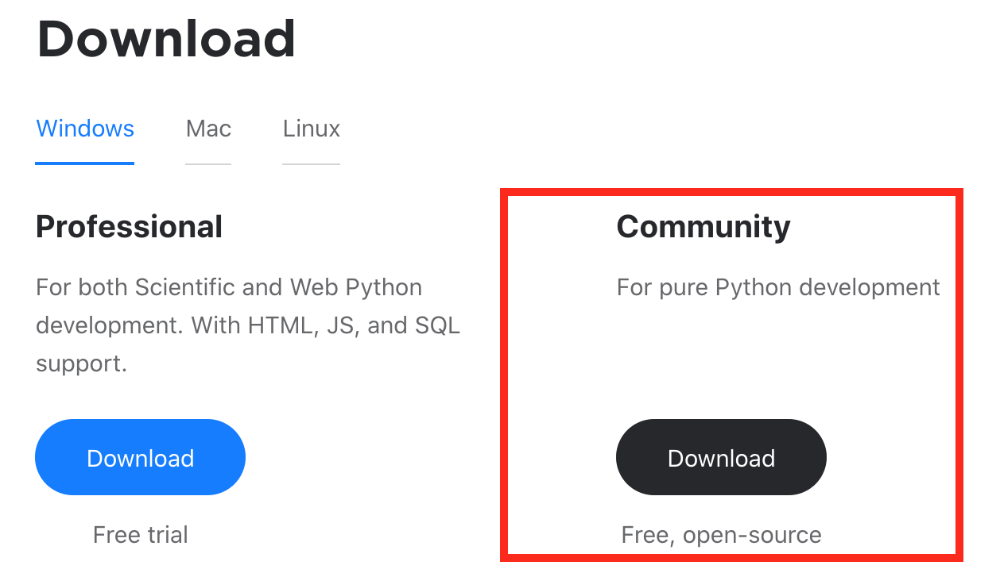
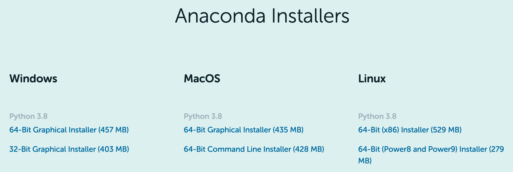
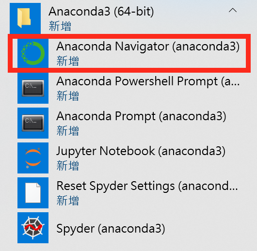
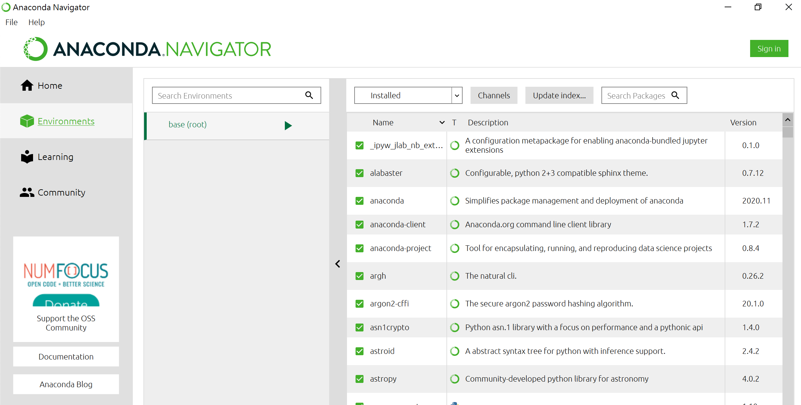

## Anaconda與PyCharm的下載安裝

### PyCharm下載安裝
版本 <b>Community</b>下載網址: 
[https://www.jetbrains.com/pycharm/download/](https://www.jetbrains.com/pycharm/download/) 
 

### Anaconda下載安裝
版本 <b>Individual Edition</b> 下載網址: 
[https://www.anaconda.com/products/individual](https://www.anaconda.com/products/individual) 

### 開啟Anaconda Navigator

#### 檢視PyCharm Community

#### 檢視Conda環境與套件

