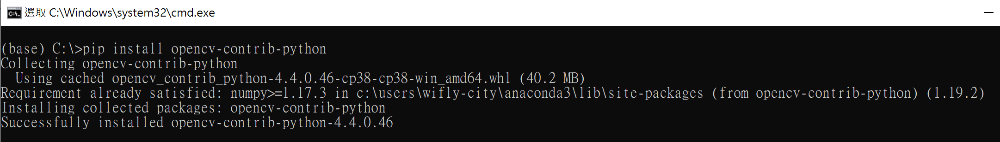

## Anaconda 安裝套件 <i>opencv-contrib-python</i>


### 開啟 Anaconda base環境下的 terminal


### 使用pip安裝 <i>opencv-contrib-python</i>
```
C:\>pip install opencv-contrib-python
```


### 檢視Anaconda base環境套件安裝完成


