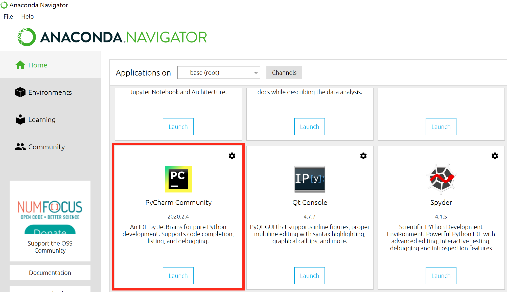
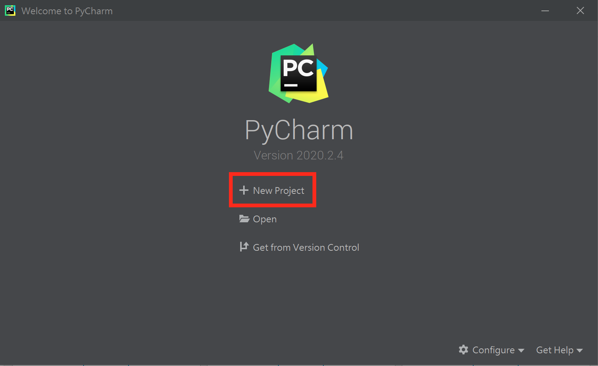
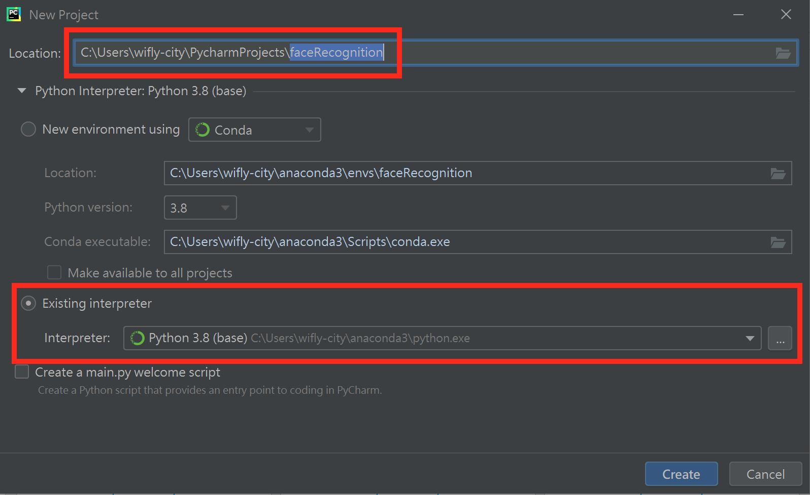

# PyCharm 新增專案

## 開啟 PyCharm Community

## 新增專案

## 設定專案環境
+ <b>Location:</b> 將 <b>pythonProject</b> 改名為 <b>faceRecognition</b>
+ <b>Existing interpreter:</b> Python 3.8 <b>(base)</b>
+ <b>Create</b>

